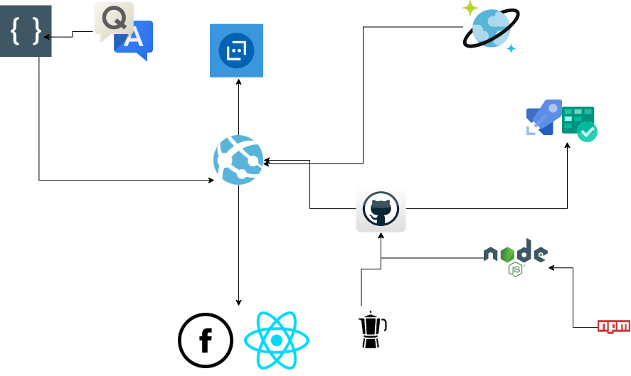

# Auto Loans

This repository contains overview documentation and project management materials
for the *autoloans* product.

#### In this README

- [Product Overview](#product-overview)
- [Architecture Description](#architecture-description)
- [Developer Guide](#developer-guide)

## Product Overview

*autoloans* is a bot to help users get a quotation for an autoloan.
Users can ask ask questions related to the auto loan industry and
get a quotation. If the user wishes they can see what the maximum
amount they can borrow would be based on their individual cicumstances.


## Architecture Description

### Luis Ai

The bot will have a the ability to recognise the difference between a 
user question or a user intent. There is one parent dispatch app, with 
two child apps, one being the qna and the other being the loan dialog
recognizer. Luis also has the capability to add in predefined entities.
we have added in age, birthday and money. Luis will give a score when it
attemps to recognize an entity and the score represents how close it thinks
it got the the correct answer. Luis will learn over time and its scores will
eventually increase. Luis score can be found in the Luis trace which tells
us the Luis prediction and score. Luis can recognize entities (things) in our
case a lender is an entity, and utterances and intents. An utterance is a 
sentence e.g "I need a loan", and "get a loan would be the intent".


- [Find out more about LUIS](www.LUIS.ai)
### Qna Maker

Qna Maker offers the possibility of loading a pre-exisiting bank of questions and
anwsers into a portal where the bot can recogize the questions and respond with the
corresponding answer. In this project we have taken an faq solution and modified
it by adding our own unique questions and answers, allowing the possibility of
follow up questions and we have it sitting inside a luis app.

- [Find out more about qnamaker](https://www.qnamaker.ai/)


### Nodejs

This project used nodejs which is an asynchronous event-driven JavaScript runtime, Node.js is designed to build scalable network applications. Many connections can be handled concurrently making it ideal for a chat bot. Upon each connection, the callback is fired, but if there is no work to be done, Node.js will sleep.

- [Find out more about Nodejs](https://nodejs.org/en/)
### BotFramework

BotFramework allows you to create a bot with the ability to speak, listen, understand, and learn from your users with Azure Cognitive Services. It is open & extensible. You can benefit from open source SDK and tools to build, test, and connect bots that interact naturally with users, wherever they are. Botframework offers direct line api and multiple channels where we can wire the bot into Facebook as we have done and also a React app.

### Sendgrid API

We have used Sendgrid API to send quotes to our users.

- [Find out more about Sendgrid](https://sendgrid.com/solutions/email-api/)

### Azure Cosmos DB

Azure Cosmos DB is Microsoft's globally distributed, multi-model database service. With a click of a button, Cosmos DB enables you to elastically and independently scale throughput and storage across any number of Azure regions worldwide. You can elastically scale throughput and storage, we have used this to store bot conversations, it is ideal as it is non relational.

- [Find out more about CosmosDB](https://docs.microsoft.com/en-us/azure/cosmos-db/introduction)


### Microsoft Azure 
Cloud computing platforms, like Azure, tend to be less expensive and more secure, reliable, and flexible than on-premises servers. With the cloud, equipment downtime due to maintenance, theft, or damage is almost non-existent. You can scale your compute and storage resources—up or down—almost instantly when your needs change on Azure. Also, you typically pay only for the services you use, which provides a level of convenience and cost-control that’s almost impossible to achieve with on-site infrastructure.
In this project we utilize azure's resource groups, deployment centre, app plans and app services to store and run all of our resources including qnamaker and Luis Ai. We deploy our code from git and it runs through an azure pipeline and into the azure app service where the user can chat in the web console.


### Environments

We have used truck based development so we just have a *production* system.

### Tests

We have used SonarCloud to check for code smells and bugs, it is ran every time the azure pipeline runs and intergrated into the .yaml file. We have a suite of mocha tests in the bot and we have also executed user acceptance tests.

- [Find out more about SonarCloud](https://sonarcloud.io/)
### CI / CD

Continuous Integration / Continuous Deployment will be used to support fast deployment
of new features to production, as they are developed. We have a pipeline that runs from git into azure straight to production.
Azure devops was used for project management as and a boards section was very helpful for management of tasks. This was also used for a ci/cd pipeline where sonarcloud was integrated.

- [Find out more about Azure Devops](https://dev.azure.com/)

## Developer Guide


Using Bot Framework v4 core bot.

This bot has been created for a final year project and uses:

- [LUIS](https://www.luis.ai) to implement core AI capabilities
- A multi-turn conversation using Dialogs
- Handling user interruptions for such things as `Help` or `Cancel`
- Prompt for and validate requests for information from the user
- QnA Maker for user questions


## Prerequisites

This project **requires** prerequisites in order to run.
- GitHub Account
- Azure Account
- npm v12.16.0

### Overview

This bot uses [LUIS](https://www.luis.ai), an AI based cognitive service, to implement language understanding. It uses QnA Maker for user queries. It stores the data in cosmos db. The app will let a user ask questions about a loan and calculate a loan amount based on information they provide and the current API rates.

- [Node.js](https://nodejs.org) version 10.14 or higher

    ```bash
    # determine node version
    node --version
    ```

### Create a LUIS Application to enable language understanding
The LUIS language model setup, training, and application configuration steps can be found [here](https://docs.microsoft.com/en-us/azure/bot-service/bot-builder-howto-v4-luis?view=azure-bot-service-4.0&tabs=javascript).

Once you created the LUIS model, update `.env` with your `LuisAppId`, `LuisAPIKey` and `LuisAPIHostName`.

```text
LuisAppId = "Your LUIS App Id"
LuisAPIKey = "Your LUIS Subscription key here"
LuisAPIHostName = "Your LUIS App region here (i.e: westus.api.cognitive.microsoft.com)"
```

## To try this project

- Clone the repository

    ```bash
    git clone https://github.com/x00141559/carBot.git
    ```

- In a terminal, navigate to `carBot`

    ```bash
    cd carBot
    ```

- Install modules

    ```bash
    npm install
    ```

- Setup LUIS

    The prerequisites outlined above contain the steps necessary to provision a language understanding model on www.luis.ai.  Refer to _Create a LUIS Application to enable language understanding_ above for directions to setup and configure LUIS.

- Run the sample

    ```bash
    npm start
    ```

## Testing the bot using Bot Framework Emulator

[Bot Framework Emulator](https://github.com/microsoft/botframework-emulator) is a desktop application that allows bot developers to test and debug their bots on localhost or running remotely through a tunnel.

- Install the Bot Framework Emulator version 4.3.0 or greater from [here](https://github.com/Microsoft/BotFramework-Emulator/releases)

### Connect to the bot using Bot Framework Emulator

- Launch Bot Framework Emulator
- File -> Open Bot
- Enter a Bot URL of `http://localhost:3978/api/messages`

## Deploy the bot to Azure

To learn more about deploying a bot to Azure, see [Deploy your bot to Azure](https://aka.ms/azuredeployment) for a complete list of deployment instructions.

## Further reading

- [Bot Framework Documentation](https://docs.botframework.com)
- [Bot Basics](https://docs.microsoft.com/azure/bot-service/bot-builder-basics?view=azure-bot-service-4.0)
- [Dialogs :)](https://docs.microsoft.com/en-us/azure/bot-service/bot-builder-concept-dialog?view=azure-bot-service-4.0)
- [Gathering Input Using Prompts](https://docs.microsoft.com/en-us/azure/bot-service/bot-builder-prompts?view=azure-bot-service-4.0&tabs=csharp)
- [Activity processing](https://docs.microsoft.com/en-us/azure/bot-service/bot-builder-concept-activity-processing?view=azure-bot-service-4.0)
- [Azure Bot Service Introduction](https://docs.microsoft.com/azure/bot-service/bot-service-overview-introduction?view=azure-bot-service-4.0)
- [Azure Bot Service Documentation](https://docs.microsoft.com/azure/bot-service/?view=azure-bot-service-4.0)
- [Azure CLI](https://docs.microsoft.com/cli/azure/?view=azure-cli-latest)
- [Azure Portal](https://portal.azure.com)
- [Language Understanding using LUIS](https://docs.microsoft.com/en-us/azure/cognitive-services/luis/)
- [Channels and Bot Connector Service](https://docs.microsoft.com/en-us/azure/bot-service/bot-concepts?view=azure-bot-service-4.0)
- [Restify](https://www.npmjs.com/package/restify)
- [dotenv](https://www.npmjs.com/package/dotenv)
